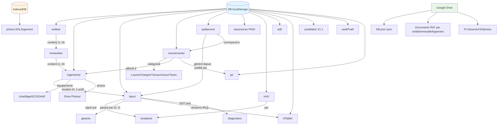
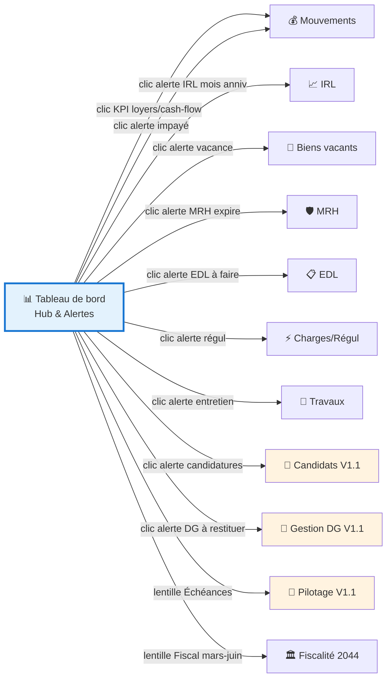
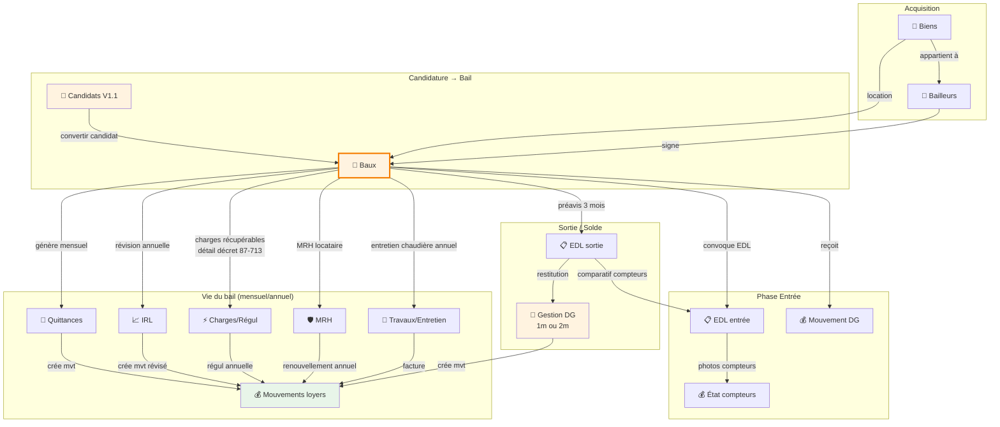
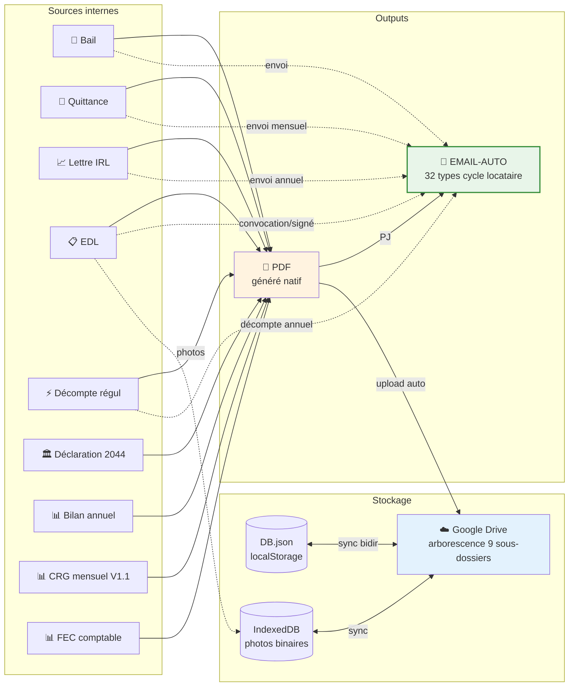
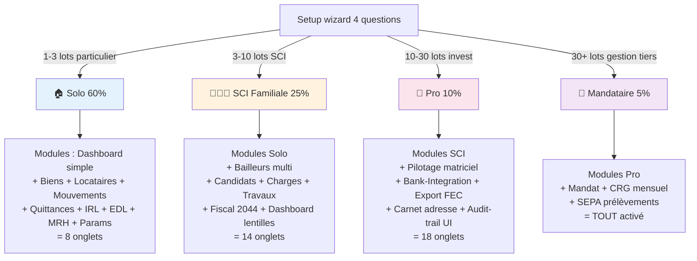
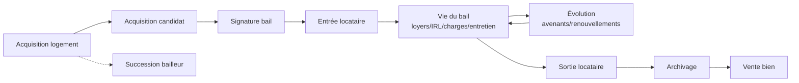

# ARBORESCENCE-APP — Cartographie complète + analyse features + plan d'actions

**Date** : 2026-05-13
**Version analysée** : v15.01 sandbox (29 830 lignes) / v14.96 prod (29 533 lignes)
**Auteur** : session pilotage Claude
**Cible** : `feedback_pas_copier_concurrent.md` → vision « simple d'utilisation + UX améliorée »

---

## 🎯 Vision filtre — Profils utilisateur

ImmoTrack doit s'adapter à **4 profils** distincts plutôt que TOUT montrer à TOUT LE MONDE :

| Profil | Cible % marché | Onglets activés par défaut | Modules cachés par défaut |
|---|---|---|---|
| 🏠 **Particulier Solo** (1-3 lots) | 60% | Dashboard, Biens, Locataires, Mouvements, Quittances, IRL, EDL, Paramètres | Pilotage matriciel, CRG, FEC, Mandat Hoguet, SEPA, Carnet d'adresse, Candidats |
| 👨‍👩‍👧 **SCI Familiale** (3-10 lots) | 25% | + Bailleurs (multi), Charges/Régul, Fiscalité 2044, Travaux, MRH | CRG, FEC, Mandat Hoguet, SEPA |
| 💼 **Investisseur Pro** (10-30 lots) | 10% | + Pilotage matriciel, Bank-Integration, Candidats, Carnet d'adresse | Mandat Hoguet, CRG mensuel |
| 🏢 **Mandataire Hoguet** (30+ lots, gestionnaire pro) | 5% | TOUT activé (Mandat, CRG, FEC, SEPA, Audit-trail) | Rien caché |

→ **Mécanisme proposé** : Setup wizard à la 1ère ouverture qui choisit le profil + bouton "Modifier mon profil" dans Paramètres → active/désactive les onglets sidebar et sections.

---

## 📊 Arborescence DATA (entités + relations)

**Sources de vérité** :
- **localStorage `DB`** : entités/logements/baux/mouvements/quittances/MRH/EDL/IRL/candidats/auditTrail (texte ≤ 700 Ko)
- **IndexedDB `immotrack_photos`** : photos binaires EDL + logement (peut atteindre 100+ Mo)
- **Drive (optionnel)** : sync DB.json + sous-dossiers documents (cf DRIVE-ARBORESCENCE)

---

## 🗺️ Arborescence UX (sidebar + interactions inter-onglets)

### Diagramme 1 — Hub Dashboard + alertes

Le **Tableau de bord** est le hub central. Toutes les alertes pointent vers l'onglet de résolution.

### Diagramme 2 — Cycle de vie bail (interactions données)

Le **bail** est l'objet métier pivot. Tous les autres onglets gravitent autour.

### Diagramme 3 — Outputs (PDF + Email) + Sync Drive

Toutes les actions génèrent **soit un PDF, soit un email, soit les deux**, et passent par Drive.

### Diagramme 4 — Profils utilisateur → modules activés

→ Cf sujet `USER-PROFILE-FILTERS` pour implémentation.

---

## 📦 Inventaire complet par onglet (✅ livré / 🔄 partiel / ⬜ manquant)

### 📊 Dashboard
| Feature | Statut | Verdict simplicité |
|---|---|---|
| KPI tuiles (loyers/occupation/cash-flow) | ✅ DASH-V2 livré | ✅ essentiel |
| Sparklines tendance | ✅ livré | ✅ utile |
| Drill-down entité/immeuble/logement | ✅ livré | ⚠️ peut-être trop pour solo (filtre profil) |
| Markers changement de bail | ✅ livré v12.28-32 | ⚠️ détail utile pro |
| Lentilles persona | ⏳ DASH-PROFILES Phase 1 livrée, attente validation | ⭐ vraie valeur si 2-4 lentilles max |
| Calcul temporel correct (mois passé) | ⬜ BUG-DASH-001 P1 | 🔴 critique |
| KPI HC vs TTC | ⬜ DASH-KPI-HC | ⚠️ détail expert |

### 🏢 Biens / Logements
| Feature | Statut | Verdict |
|---|---|---|
| Liste cartes (LOG-LISTE-CARDS) | ✅ livré v14.2 | ✅ essentiel |
| Toolbar (recherche/filtre/tri/export) | ✅ livré v14.2 | ✅ essentiel |
| Toggle Immeubles ↔ Logements | ✅ livré v14.2 | ✅ utile multi-lots |
| Tabs Actifs/Archivés | ✅ livré v14.2 | ✅ utile |
| Fiche 360 (header + onglet Bail + drill) | ✅ Bloc A livré v14.13 | ✅ essentiel |
| Fiche 360 sous-onglets Phase 2 (5) | ⬜ LOG-FICHE-360 Phase 2 | ⚠️ utile si on attaque sans surcharger |
| Galerie photos logement | ✅ LOG-PHOTOS Sprint 5C v15.01 | ✅ utile (couplé annonces) |
| Référence modifiable | ⬜ BUG-LOG-001 | ✅ fix simple |
| Garde-fou HC aberrant | ✅ BUG-HC-GARDE-FOU livré v14.84 | ✅ utile |
| Équipements contrôles périodiques | ⬜ EQUIP-CONTROLES-PERIODIQUES P1 | ⚠️ surcharge si > 10 catégories |

### 👤 Bailleurs / Entités
| Feature | Statut | Verdict |
|---|---|---|
| Liste cartes | ✅ livré | ✅ essentiel multi-bailleur |
| Fiche 360 (ENT-FICHE) | ✅ Phase 1 livré | ✅ essentiel |
| Form profil enrichi (SIRET API, IBAN) | ⬜ BAILLEUR-FORM-RICHE | ⚠️ P3 sauf si SEPA |
| Automatisations centralisées | ⬜ PARAM-BAILLEUR-AUTOMATISATIONS P2 | ⚠️ utile à 5+ baux |
| Rename cascade | ✅ BUG-ENT-RENAME-CASCADE livré v14.51 | ✅ essentiel |
| Orphans cleanup | ✅ BUG-ENT-ORPHANS-CLEANUP livré v14.52-53 | ✅ technique safe |

### 📜 Baux
| Feature | Statut | Verdict |
|---|---|---|
| Wizard 4 étapes | ✅ V3-REFONTE-BAIL en cours | ✅ essentiel |
| Signature électronique (canvas) | ✅ livré | ✅ essentiel |
| Snapshot signé + diff Aperçu | ✅ livré v13.10-11 | ✅ utile |
| PDF natif | ⬜ BAIL-PDF-NATIF P2 | ⚠️ qualité PDF |
| Clauses personnalisables | ⬜ BAIL-CLAUSES-PERSO P2 | ⚠️ utile pro |
| 5 types bail (meublé/garage/mobilité/étudiant) | ⬜ BAIL-TYPES P2 | ⚠️ utile LMNP |
| Charges détaillées décret 87-713 | ⬜ BAIL-CHARGES-DETAIL P1 | 🔴 protection légale critique |
| Multi-bailleurs + multi-garants | ✅ livré v13.19-21 + v13.36 | ✅ utile SCI |

### 💰 Mouvements
| Feature | Statut | Verdict |
|---|---|---|
| Saisie mouvement | ✅ existant | ✅ essentiel |
| Scindage ligne | ✅ existant | ⚠️ utile expert |
| Catégorie au scindage | ⬜ MVT-SCIND-CAT | ✅ amélioration UX simple |
| Mouvements récurrents | ⬜ MVT-RECURRENT P2 | ✅ utile (assurance, prêt mensuel) |
| Import CSV/OFX bancaire | ⬜ BANK-INTEGRATION V1 P2 | ⭐ vraie valeur |

### 🧾 Quittances
| Feature | Statut | Verdict |
|---|---|---|
| Génération PDF | ✅ existant | ✅ essentiel |
| Envoi email (mode proposition) | ✅ EMAIL-AUTO v14.97 | ✅ utile |
| Envoi automatique | ⬜ V1.1 | ⚠️ V2 SaaS pour vrai auto |
| Avis échéance | ⬜ AVIS-ECHEANCE P2 | ⚠️ utile multi-baux |
| Rappels impayés escalade | ⬜ RAPPEL-IMPAYE P2 | ⚠️ utile multi-baux |

### 📈 IRL
| Feature | Statut | Verdict |
|---|---|---|
| Lettre IRL conforme | ✅ IRL-LETTRE-REVISION livré | ✅ essentiel |
| Validation envoi + rappel | ✅ IRL-VALIDATION v13.33 | ✅ essentiel |
| Gel DPE F/G (loi Climat) | ✅ IRL-DPE-FG v13.31 | ✅ essentiel légal |
| Mention "mois anniversaire" correcte | ✅ BUG-IRL-001 v13.30 | ✅ légal |
| Bulk update IRL annuel | ⬜ PILOTAGE-MATRICIEL P1 | ⭐ gain temps réel |

### 📋 EDL
| Feature | Statut | Verdict |
|---|---|---|
| EDL entrée/sortie photos | ✅ livré v14.4-7 | ✅ essentiel |
| PDF natif + Drive auto | ✅ EDL-PDF-DRIVE v14.10.3 | ✅ essentiel |
| Comparatif compteurs | ✅ livré | ✅ essentiel |
| Validation template avocat | ⬜ EDL-VALIDATION-AVOCAT P1 | 🔴 légal critique avant commerce |
| EDL délégué (tiers fait l'EDL) | ⬜ EDL-DELEGUE-EXPORT/IMPORT P2 | ⭐ différenciant unique |
| Template par logement | ⬜ EDL-TEMPLATE-PER-LOG P2 | ⚠️ surcharge si peu de variation |
| DAAF photo obligatoire | ⬜ EQUIP-CONTROLES-PERIODIQUES P1 | ⭐ preuve juridique différenciante |

### ⚡ Charges / Régul
| Feature | Statut | Verdict |
|---|---|---|
| Calcul régul | 🔴 BUG-CHARGE-001 P1 (KO actuellement) | 🔴 critique fix |
| Charges communes immeuble | ✅ CHARGES-COMMUNES Phase 1-2 livré v14.59-61 | ✅ essentiel copro |
| Règles tantième/compteur (chauffage 30/70) | ⬜ CHARGE-REGLES P2 | ⚠️ utile copro |

### 🏛️ Fiscal / Légal
| Feature | Statut | Verdict |
|---|---|---|
| Wizard 2044 | ✅ LEGAL-2044 livré v14.90 | ⭐ différenciant fort |
| Bilan annuel PDF | ✅ LEGAL-BILAN-ANNUEL livré v14.92 | ✅ utile |
| Export comptable FEC + journal + grand livre | ✅ EXPORT-COMPTABLE livré v14.93 | ⚠️ pro uniquement (filtre profil) |
| Liasse 2072 SCI IR | ⬜ LEGAL-2072 P3 | ⚠️ niche |
| RGPD UI Mes données | ✅ RGPD-COMPLIANCE livré v14.91 | ✅ obligatoire |
| Audit-trail | ✅ AUDIT-TRAIL livré v14.89 | ⚠️ technique, masqué par défaut |

### 💾 Drive / Sync
| Feature | Statut | Verdict |
|---|---|---|
| Sync DB JSON | ✅ existant | ✅ essentiel |
| Protection signature offline | ✅ BUG-DRIVE-OVERWRITE v13.38 | ✅ critique |
| Token expiry géré | ✅ BUG-DRIVE-DISCONNECT v13.41 | ✅ critique |
| Arborescence 9 sous-dossiers + bidir | ⬜ DRIVE-ARBORESCENCE 🔄 | ✅ utile |
| Multi-users (OCC + awareness) | ⬜ DRIVE-2H/2F/2G | V2 SaaS |
| Audit log Drive | ⬜ DRIVE-2I | V2 SaaS |

### 🎯 Pilotage matriciel (V1.1 — nouveau)
| Feature | Statut | Verdict |
|---|---|---|
| Suivi comptable multi-baux | ⬜ PILOTAGE-MATRICIEL P1 | ⭐ gain temps pro |
| Suivi documents compliance | ⬜ même sujet | ⭐ visualisation compliance |
| Bulk update loyers IRL annuel | ⬜ même sujet | ⭐ vraie économie temps |
| SEPA prélèvements V1 | ⬜ SEPA-PRELEVEMENTS V2 SaaS | ⚠️ V2 SaaS |

### Autres modules
| Module | Statut | Verdict |
|---|---|---|
| Candidats (pipeline + conversion bail) | ⬜ LOG-CANDIDATS P1 | ⭐ utile bailleur autonome |
| MRH auto-locataire | ⬜ MRH-AUTO-LOC P2 | ✅ fix UX simple |
| Travaux + calendrier | ⬜ TRAV-SUIVI P2 | ⚠️ surcharge si peu de travaux |
| PJ documents | ✅ DOC-PJ Sprint 5B livré v15.00 | ✅ utile |
| Import Excel | ⬜ IMPORT-EXCEL-LOG P2 | ⚠️ utile onboarding |
| Import depuis concurrents | ⬜ IMPORT-CONCURRENTS P2 | ✅ utile onboarding migration |
| Mobile audit onglets | ⬜ MOBILE-AUDIT-ONGLETS P1 | 🔴 critique cible 50% mobile |

---

## ❌ Features à ÉCARTER (superflues pour la cible)

| Feature | Pourquoi superflu | Statut |
|---|---|---|
| **DASH-RACCOURCIS** | La sidebar fait déjà le job, doublonner = pollution UX | ❌ déjà écarté |
| **DASH-AGENDA-INTEGRE** | Doublon DASH-PROFILES lentille Échéances | ❌ déjà écarté |
| **CARNET-ADRESSE** (P3) | Pour bailleur 1-10 lots, le téléphone perso suffit | P3 (V2 pro) |
| **PARAM-BAILLEUR-LOGO-SIG par bailleur** | Logo global suffit pour particulier | V2 SaaS multi-tenant |
| **PARAM-BAILLEUR-SMTP par bailleur** | Mode "proposition" mailto: suffit en V1 | V2 SaaS |
| **IMM-FICHE-SOUS-ONGLETS** (7 sous-onglets) | 5/7 doublons d'autres sujets | Re-scope P3 minimal |
| **AGENCE-GESTION/CRG/HONORAIRES** | Cible mandataire pro Hoguet uniquement | V2 ou V1.1 si pivot |
| **SAAS-MULTIUSERS / PORTAIL-LOC** | V2 SaaS uniquement | V2 |
| **OCR-FACTURE / COMPARATEUR-LOYER** | Nice-to-have V3 | V3 |

→ Ces features restent dans le backlog mais **NE doivent PAS polluer la roadmap V1.1**.

---

## 🔴 Features MANQUANTES critiques (à attaquer V1.1)

### P0 — Bloquant V1 commerciale
1. **BUG-CHARGE-001** régul charges KO (fix P1/M)
2. **BUG-DASH-001** temporalité dashboard (fix P1/M)
3. **EDL-VALIDATION-AVOCAT** validation décret 2016-382 (XS, juste envoi)
4. **SECU-INNERHTML résidus** si pas 100% fixé Sprint 1A

### P1 — Différenciants vraie valeur (V1.1)
1. **LOG-CANDIDATS** — pipeline + conversion auto bail (5-8h)
2. **PILOTAGE-MATRICIEL** — bulk update IRL + compliance docs (8-12h)
3. **BANK-INTEGRATION V1 CSV/OFX** — import transactions (5-8h)
4. **BAIL-CHARGES-DETAIL** — protection légale décret 87-713 (3-5h)
5. **EQUIP-CONTROLES-PERIODIQUES** + **BAILLEUR-DIAGNOSTICS-DDT** — légal + différenciant DAAF EDL (10h combinés)
6. **MOBILE-AUDIT-ONGLETS** — irréprochable mobile (1-2j)

### P2 — Polish UX V1.1
- **MVT-SCIND-CAT** (catégorie au scindage) — XS
- **MVT-RECURRENT** (assurance/prêt récurrent) — M
- **MRH-AUTO-LOC** — S
- **ENT-SAVE-IMM** — S
- **BUG-LOG-001** réf logement modifiable — XS
- **BUG-UI-DARK-MODAL** — XS

---

## 🛠️ Proposition technique — Filtres d'activation profils

### Mécanisme
- Nouveau champ `DB.params.userProfile` : `'solo' | 'sci_familiale' | 'pro' | 'mandataire'`
- Setup wizard à la 1ère ouverture : 4 questions max
  1. Combien de logements ? (1-3 / 3-10 / 10-30 / 30+)
  2. Statut juridique ? (Particulier / SCI / SAS / Mandataire Hoguet)
  3. Activité commerciale (mandataire pour autres) ? (Oui/Non)
  4. Niveau pro comptable ? (Autonome / Excel / Expert-comptable)
- Détermine le profil + active les onglets/modules cibles

### Configuration par profil (matrice activation)

| Module | Solo | SCI | Pro | Mandataire |
|---|---|---|---|---|
| Dashboard simple (4 KPI) | ✅ | ✅ | ✅ | ✅ |
| Dashboard avancé (lentilles) | masqué | ✅ | ✅ | ✅ |
| Biens | ✅ | ✅ | ✅ | ✅ |
| Bailleurs multi | masqué | ✅ | ✅ | ✅ |
| Locataires | ✅ | ✅ | ✅ | ✅ |
| Candidats | masqué | ✅ | ✅ | ✅ |
| Baux | ✅ | ✅ | ✅ | ✅ |
| Mouvements | ✅ | ✅ | ✅ | ✅ |
| Quittances | ✅ | ✅ | ✅ | ✅ |
| IRL | ✅ | ✅ | ✅ | ✅ |
| EDL | ✅ | ✅ | ✅ | ✅ |
| Charges/Régul | basique | ✅ | ✅ | ✅ |
| MRH | ✅ | ✅ | ✅ | ✅ |
| Travaux | masqué | ✅ | ✅ | ✅ |
| Pilotage matriciel | masqué | masqué | ✅ | ✅ |
| Fiscal 2044 | basique | ✅ | ✅ | ✅ |
| Export FEC | masqué | masqué | ✅ | ✅ |
| Mandat / CRG / SEPA | masqué | masqué | masqué | ✅ |
| Audit-trail UI | masqué | masqué | ✅ | ✅ |
| Carnet d'adresse | masqué | masqué | ✅ | ✅ |
| Bank-Integration | masqué | option | ✅ | ✅ |

### UI
- Onglet Paramètres → section "Profil utilisateur" avec :
  - Profil actuel (badge cliquable)
  - Bouton "Modifier mon profil"
  - **Liste des modules** avec toggles individuels (override par défaut profil)
- Mémorisation localStorage `immotrack_user_profile`
- Auto-détection du nb de logements + suggestion changement profil si dépassement seuil

### Sujet backlog à créer
**USER-PROFILE-FILTERS** (P1 V1.1, ~3-5h) — système profils + filtres activation modules. Permet à un solo de ne voir que ses 8 onglets utiles, et à un mandataire d'avoir tout. **Pas de surcharge UX par profil.**

---

## 📋 Plan d'actions V1.1 (priorisé, ~28-40h)

### Phase A — Foundations Simplicité (Sprint 6, ~6-8h)
1. **USER-PROFILE-FILTERS** (3-5h) — Setup wizard + filtres modules par profil. **Ouvre la voie à la simplicité UX cible**.
2. **BUG-CHARGE-001** fix (3h) — débloque feature régul cassée.

### Phase B — Différenciants critiques (Sprint 7, ~12-15h)
3. **LOG-CANDIDATS** (5-8h) — pipeline + conversion auto bail (différenciant gros gain temps user).
4. **BAIL-CHARGES-DETAIL** (3-5h) — protection légale décret 87-713.
5. **EDL-VALIDATION-AVOCAT** (1-2h envoi avocat) — débloquer validation légale décret 2016-382.

### Phase C — Pilotage & Bank (Sprint 8, ~10-15h)
6. **PILOTAGE-MATRICIEL** (8-12h) — vue multi-baux bulk update IRL.
7. **BANK-INTEGRATION V1 CSV/OFX** (5-8h) — import transactions.

### Phase D — Légal équipements (Sprint 9, ~10-12h)
8. **EQUIP-CONTROLES-PERIODIQUES** + **BAILLEUR-DIAGNOSTICS-DDT** combinés (~10h) — différenciants DAAF EDL photo + DDT bloquage bail.

### Phase E — Mobile irréprochable (Sprint 10, 1-2j)
9. **MOBILE-AUDIT-ONGLETS** — audit + fix onglet par onglet.

### Phase F — Polish UX final (Sprint 11, ~5h)
10. Bugs P2 résiduels : MVT-SCIND-CAT, MVT-RECURRENT, MRH-AUTO-LOC, ENT-SAVE-IMM, BUG-LOG-001, BUG-UI-DARK-MODAL, BUG-EQUIP-FILTER.

**Total Sprint 6-11 V1.1** : ~40-50h (réparti sur ~3 mois à 15-18h/mois solo).

---

## 🔄 Plan V1.1 CORRIGÉ (2026-05-13) — couverture complète backlog

Suite à audit honnête, mon plan ne couvrait que ~18/83 sujets. Ajout de 4 sprints :

| Sprint | Phase | Effort | Sujets clés |
|---|---|---|---|
| 6 | A. Foundations Simplicité | 6-8h | **USER-PROFILE-FILTERS** + BUG-CHARGE-001 + BUG-DASH-001 |
| 7 | B. Différenciants critiques | 12-15h | **LOG-CANDIDATS** + BAIL-CHARGES-DETAIL + EDL-VALIDATION-AVOCAT |
| 8 | C. Pilotage & Bank | 10-15h | **PILOTAGE-MATRICIEL** + BANK-INTEGRATION V1 CSV |
| 9 | D. Légal équipements | 10-12h | EQUIP-CONTROLES-PERIODIQUES + BAILLEUR-DIAGNOSTICS-DDT |
| **10 🆕** | **E. EMAIL-AUTO Extension cycle locataire** | **5-7h** | **23 nouveaux types email** (candidatures, bail, EDL, vie, évolution, sortie) + intégration UI fiche candidat/bail/EDL/équipements |
| **11 🆕** | **F. Quittances actives** | 4-6h | AVIS-ECHEANCE + RAPPEL-IMPAYE (consommatrices EMAIL-AUTO étendu) |
| **12 🆕** | **G. Gestion DG & Impayés** | 7-9h | GESTION-DG (P1 V1.1) + GESTION-IMPAYE (P1 V1.1) |
| **13 🆕** | **H. DASH-PROFILES Phase 2** | 8-10h | Implémentation 4 lentilles (après validation aperçu) |
| **14 🆕** | **I. EDL délégué + Drive arbo** | 8-10h | EDL-DELEGUE-EXPORT/IMPORT (différenciant unique) + finalisation DRIVE-ARBORESCENCE |
| 15 | J. Mobile irréprochable | 1-2j (~10h) | MOBILE-AUDIT-ONGLETS |
| 16 | K. Polish UX final | ~5h | Bugs P2 résiduels |

**Total V1.1 corrigé** : **~75-95h sur 4-5 mois** (réparti à 15-18h/mois solo).

### Sujets explicitement HORS V1.1
- FICHES-PARITE-360 (27h) → V1.2 indépendant
- ARCHI-MODULAR Phase 3+ → V2 post-V1
- ARCHI-DB-DOUBLONS → CDC requis avant
- GESTION-MANDAT + CRG complet → V1.2 si pivot mandataire confirmé
- DRIVE-2H/2F/2G → V2 SaaS multi-users
- V3-REFONTE-* onglet par onglet → V1.2/V2 progressif
- V1.2 sectoriel (TVA / LMNP / encadrement / sinistre / travaux)
- V3 premium (OCR / comparateur / eIDAS / portail loc)

---

## 🎯 Recommandations stratégiques finales

1. **USER-PROFILE-FILTERS est LA feature qui change tout** : permet de garder TOUTES les features du backlog tout en n'en montrant à chaque user que ce qui le concerne. **À attaquer en 1ère** pour la vision « simple d'utilisation ».
2. **LOG-CANDIDATS + PILOTAGE-MATRICIEL + BANK-INTEGRATION V1 CSV** = les 3 vraies pépites V1.1.
3. **Bypass tous les P2/P3 non bloquants** jusqu'à la commercialisation publique (V1.1 → bêta).
4. **Validation visuelle marathon V1 (Sprint 1-4 sandbox v14.96)** prioritaire AVANT V1.1 — sinon dette technique sandbox/prod.

---

## 🎯 Audit 360° — 5 vues croisées (ajout 2026-05-13)

Pour ne plus rien oublier, croiser TOUTE feature/sujet selon ces 5 vues. **Si une feature n'est pas cohérente avec les 5 → écarter ou re-cadrer.**

### Vue 1 — Cycle de vie complet bail+locataire

| Étape cycle | Couverture V1.1 | Trous identifiés |
|---|---|---|
| Acquisition logement | ✅ Biens / Fiche bien | IMPORT-EXCEL-LOG (P2) non dans plan |
| Acquisition candidat | ⬜ LOG-CANDIDATS Sprint 7 | Bon |
| Signature bail | ✅ wizard livré | Avenants étendus EMAIL-AUTO |
| Entrée locataire | ✅ EDL + DG livrés | Bienvenue infos pratiques → EMAIL-AUTO étendu Sprint 10 |
| Vie du bail | ✅ très couvert | Notifications travaux/visites → EMAIL-AUTO étendu |
| Évolution | ⬜ renouvellement / congé bailleur 6 mois | Sprint 10 EMAIL-AUTO + Sprint 12 GESTION-DG |
| Sortie | ⬜ workflow EDL sortie + DG restitution 1m/2m | Sprint 10 EMAIL-AUTO + Sprint 12 GESTION-DG |
| Archivage | ✅ LOG-ARCHIVE livré | Bon |
| **Vente bien** | ❌ **TROU** | À créer LOG-VENTE-CESSION (P3, V1.2) |
| **Succession** | ❌ **TROU** | À documenter V2 (rare, dépend SAAS-MULTIUSERS) |

### Vue 2 — Rôles utilisateur

| Rôle | Profil USER-PROFILE-FILTERS | Couverture V1.1 |
|---|---|---|
| Bailleur particulier 1-3 lots | Solo (60% marché) | ✅ couvert complet |
| SCI familiale 3-10 lots | SCI Familiale (25%) | ✅ couvert |
| Investisseur 10-30 lots | Pro (10%) | ✅ couvert Sprint 8 PILOTAGE-MATRICIEL |
| Mandataire Hoguet 30+ lots | Mandataire (5%) | ⚠️ partiel (GESTION-MANDAT + CRG complets reportés V1.2) |
| Expert-comptable invité (lecture) | (V2 SaaS) | ❌ trou — V2 SAAS-MULTIUSERS |
| Co-associé SCI consultation | (V2 SaaS) | ❌ trou — V2 |
| Locataire portail | (V2 SaaS) | ❌ trou — V2 PORTAIL-LOC |

### Vue 3 — Typologies de bien

| Type | Couverture V1.1 |
|---|---|
| Bail vide loi 89-462 | ✅ couvert (défaut) |
| Bail meublé LMNP | ⚠️ partiel — BAIL-TYPES P2 reporté V1.2 (mais utilisable avec template défaut) |
| Garage / parking | ⬜ BAIL-TYPES V1.2 |
| Bail mobilité 1-10 mois | ⬜ BAIL-TYPES V1.2 |
| Bail étudiant 9 mois | ⬜ BAIL-TYPES V1.2 |
| Bail colocation | ✅ multi-locataires livré |
| **Bail saisonnier / Airbnb** | ❌ **TROU** — niche, à acter V2 si demande |
| **Bail commercial / Pinel** | ❌ **TROU** — V2 si pivot pro |

### Vue 4 — Axes techniques

| Axe | Couverture V1.1 |
|---|---|
| Sécurité XSS | ✅ SECU-INNERHTML livré Sprint 1A v14.80 |
| OAuth Drive | ✅ BUG-DRIVE-DISCONNECT livré v13.41 |
| RGPD | ✅ RGPD-COMPLIANCE livré v14.91 |
| Perf rendu | ⚠️ partiel — ARCHI-MODULAR Phase 1-2 livré, Phase 3 reportée V2 |
| Mobile / responsive | ⬜ MOBILE-AUDIT-ONGLETS Sprint 15 |
| PWA / offline | ⬜ MOBILE-PWA-OFFLINE P2 reporté V1.2 |
| Sync multi-device Drive | ✅ géré (avec BUG-DRIVE-OVERWRITE livré) |
| Multi-users Drive concurrent | ⬜ DRIVE-2H/2F/2G V2 SaaS |
| **Backup auto localStorage** | ⚠️ Drive sync = backup implicite, mais pas de snapshot horodaté → à étudier V1.2 |
| Tests unitaires Vitest | ✅ ~262 tests livrés marathon |
| **Tests E2E** (Playwright/Cypress) | ❌ **TROU** — V1.2 ou V2 |
| **Accessibilité WCAG 2.1 AA** | ❌ **TROU** — pas audité, V1.2 |
| **Performance budget** (Lighthouse 90+) | ❌ **TROU** — pas mesuré, V1.2 |
| **i18n** (anglais) | ❌ FR only, V3 ou V2 international |
| **Monitoring prod activé** | ⬜ stub livré, activation = **PROD-MONITORING-CI Sprint 16** |
| **CI validée opérationnelle** | ⬜ workflow livré, validation = **PROD-MONITORING-CI Sprint 16** |

### Vue 5 — Axes commerciaux

| Axe | Statut | Action |
|---|---|---|
| Pricing / facturation Stripe-Paddle | ⬜ Hors auto-pilote | À FAIRE PAR USER avant bêta |
| Site vitrine + landing pages | ⬜ Hors auto-pilote | À FAIRE PAR USER avant bêta |
| CGU / CGV / mentions légales | ⬜ Hors auto-pilote (templates RGPD livrés) | À faire valider avocat |
| Marketing / SEO / contenu | ⬜ Hors auto-pilote | À FAIRE PAR USER |
| Tutos vidéos (Qalimo ~22 vidéos) | ⬜ Hors auto-pilote | À FAIRE PAR USER (essentiel onboarding) |
| FAQ / base connaissances | ⬜ Hors auto-pilote | À FAIRE PAR USER |
| Helpdesk (Crisp/Intercom) | ⬜ Hors auto-pilote | À FAIRE PAR USER bêta |
| Migration depuis concurrents | ⬜ IMPORT-CONCURRENTS partial v14.94 (Rentila + BailFacile mappers) → finaliser Sprint 14 ou ajout sujet | Sprint 14 si pas déjà fait |
| Recrutement bêta-testeurs | ⬜ Hors auto-pilote | À FAIRE PAR USER (10-20 users) |
| **Monitoring prod actif** | ⬜ Sprint 16 PROD-MONITORING-CI | À acter |

---

## 🆕 Sujets ajoutés suite audit 360° (filtre pré-vol validé)

| Sujet | Prio | Effort | Justification (5 critères) |
|---|---|---|---|
| **LEGAL-DPE-INTERDICTION-LOCATION** | P1 V1.1 | 2-3h | 1/4 critères : cible 7% parc locatif FR · loi Climat 2021-1104 art. 23 · étend IRL-DPE-FG · trou cycle "Signature bail" |
| **PROD-MONITORING-CI** | P1 V1.1 | 2-3h | 4/4 : avant V1 commerciale obligatoire · stub livré v14.96 non activé · monitoring + CI valider · trou vue commerciale |

### Sujets documentés HORS V1.1 (avec justification)

- **LOG-VENTE-CESSION** (P3 V1.2) — workflow vente bien différent archivage. 2-4h. Justifié niche solo mais critique multi-bailleur Pro.
- **BAIL-SAISONNIER** (V2 si pivot) — Airbnb / location courte durée. Réglementation différente (CCH + commune).
- **BAIL-COMMERCIAL-PINEL** (V2 si pivot) — bail commercial loi Pinel. Réglementation très différente.
- **SUCCESSION-BAILLEUR** (V2) — transmission héritage. Couplé V2 SAAS-MULTIUSERS.
- **TESTS-E2E** (V1.2) — Playwright/Cypress en complément Vitest.
- **A11Y-AUDIT** (V1.2) — WCAG 2.1 AA conformité avec Lighthouse / axe-core.
- **PERFORMANCE-BUDGET** (V1.2) — Lighthouse 90+ + monitoring Web Vitals.
- **I18N-EN** (V3) — internationalisation anglais.

---

## 🔁 Plan V1.1 FINAL (audit 360° corrigé)

| Sprint | Phase | Effort | Sujets clés |
|---|---|---|---|
| 6 | A. Foundations Simplicité | 6-8h | USER-PROFILE-FILTERS + BUG-CHARGE-001 + BUG-DASH-001 |
| 7 | B. Différenciants critiques + DPE | 14-17h | LOG-CANDIDATS + BAIL-CHARGES-DETAIL + EDL-VALIDATION-AVOCAT + **LEGAL-DPE-INTERDICTION-LOCATION 🆕** |
| 8 | C. Pilotage & Bank | 10-15h | PILOTAGE-MATRICIEL + BANK-INTEGRATION V1 CSV |
| 9 | D. Légal équipements | 10-12h | EQUIP-CONTROLES-PERIODIQUES + BAILLEUR-DIAGNOSTICS-DDT |
| 10 | E. EMAIL-AUTO extension | 5-7h | 23 types email cycle locataire complet |
| 11 | F. Quittances actives | 4-6h | AVIS-ECHEANCE + RAPPEL-IMPAYE |
| 12 | G. Gestion DG & Impayés | 7-9h | GESTION-DG + GESTION-IMPAYE |
| 13 | H. DASH-PROFILES Phase 2 | 8-10h | Implémentation 4 lentilles |
| 14 | I. EDL délégué + Drive arbo + Import concurrents | 10-13h | EDL-DELEGUE-EXPORT/IMPORT + finaliser DRIVE-ARBORESCENCE + finaliser IMPORT-CONCURRENTS |
| 15 | J. Mobile irréprochable | ~10h | MOBILE-AUDIT-ONGLETS |
| 16 | K. **🆕 Production-ready** | 2-3h | **PROD-MONITORING-CI** (Sentry activé + Plausible + CI validée) |
| 17 | L. Polish UX final | ~5h | Bugs P2 résiduels (MVT-SCIND-CAT, MVT-RECURRENT, MRH-AUTO-LOC, ENT-SAVE-IMM, BUG-LOG-001, BUG-UI-DARK-MODAL, BUG-EQUIP-FILTER) |

**Total V1.1 audité 360°** : **~85-110h sur 5-6 mois** (réparti à 15-18h/mois solo).

→ Tout le reste (FICHES-PARITE-360, ARCHI-MODULAR Phase 3, GESTION-MANDAT/CRG complets, BAIL-TYPES, V3-REFONTE-*, V1.2/V2/V3, A11Y, E2E, i18n) est **explicitement reporté avec justification** ci-dessus.

---

## 📜 Sources / Références
- BACKLOG.md (~83 sujets actifs)
- AUDIT-CODE.md (rapport audit Sprint complet)
- VEILLE-QALIMO-V2-2026.md (analyse 10 captures + YouTube)
- BIZPLAN.md (vision commerciale Q4 2026)
- Mémoires : `feedback_pre-flight-checklist.md` (5 critères), `feedback_pas_copier_concurrent.md` (filtre 4 critères), `feedback_sandbox_first.md`, `feedback_modify_verify.md`, `feedback_no_bullshit.md`, etc. (15 règles gravées)
